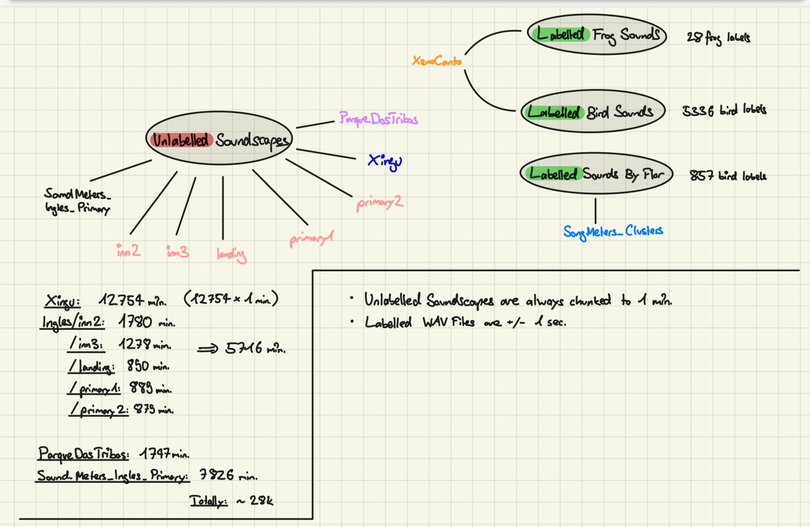

# Brainforest EcoHackathon 2024, Group "" (pronounced empty string)

## welcome and minimal setup

hi all,
i think when we start with the EDA, it suffices if anyone just uses what they are used to (f.e. conda or whatever). However, afterwards, i think it could be helpful that everyone, always has exactly the same environment, same package/python versions, which is why i propose working with docker to minimize headaches and "but it works on my machine" issues. I think with this minimal setup below, we can fully focus on hacking while not having pain with painful stuff.

please feel free to add / change / challenge things!

- [notion page](https://glamorous-shawl-578.notion.site/Bird-Chirp-Classification-d7b3f86b0c114188b2782bd9b3d78c35)
- read how to setup docker for linux (ubuntu) [here](./docs/docker-setup.md)
- read how to setup docker for mac [here](https://docs.docker.com/desktop/install/mac-install/)

### how docker compose works

essentially, you just have to build the container with the services you want. if you're interested in it i can go into more detail just let me know.

1. clone the repo

2. navigate to dc/dev and run:

```
docker compose up -d --build
```

only use the `--build` flag the first time around, or if you want to rebuild the container (e.g. when having added a package you need in the container). **NOTE:** the `-d` flag stands for `detach` which means that your docker container runs in the background and does not log everything into your console.

3. then, to check whether everything worked hit:

```
docker ps
```

4. for this specific setup, you can head to `localhost:8888` where jupyterlab is running.

5. to create a new file (using jupytext, see below), just create a new .ipynb file, the .py file will be created automatically. all the changes you make in the notebook, will be reflected in the .py files which you then can use for your commits.

now you shoold see the running docker containers.

### what about huggingface spaces:

- IMO we have two options:
  1. [connect hugginface space](https://huggingface.co/docs/hub/spaces-github-actions#managing-spaces-with-github-actions) of our group to this repo using github actions
  2. have separate hugginface space (might be a pain)

### jupytext - nice versioning of jupyter notebooks

- we are likely be working with jupyter notebooks alot
- lets use [jupytext](https://jupytext.readthedocs.io/en/latest/)
- It automatically maps .ipynb to .py files with some magic
- The .ipynb are in the gitignore, so we only have .py files nicely versioned in the repo

### trunk based development

- lets stick to trunk based
- if you dont know what it is, read all about it [here](https://trunkbaseddevelopment.com/)
- or read the [key take aways](./docs/key-takeaways-tb.md)

### code format

- lets stick to [Black](https://black.readthedocs.io/en/stable/) for python and [Prettier](https://prettier.io/) for .md and other formats
- using docker for the purpose of formatting is really easy

  1.  `chmod +x format` so that the `format` file is executable
  2.  then simply use `./format` before adding your changes and all the files will be autoformatted

## awesome data overview


